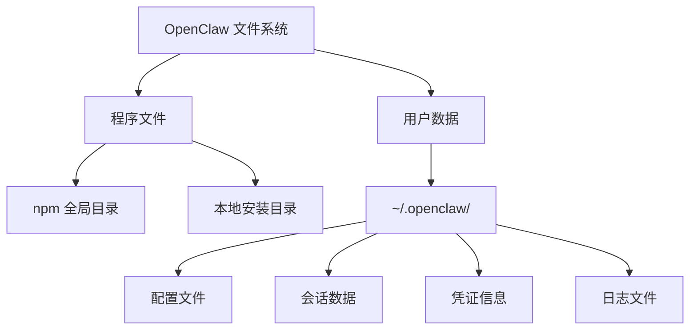

# OpenClaw 安装目录结构详解

本文档详细说明 OpenClaw 安装完成后的目录结构，包括程序文件、配置文件、运行时数据的存储位置。

## 概览

OpenClaw 的文件分布在两个主要位置：

1. **程序安装目录** - npm 包文件（只读，不应修改）
2. **用户数据目录** - 配置、会话、日志等（可修改）



---

## 1. 程序安装目录

### 1.1 npm 全局安装（推荐）

当使用 `npm install -g openclaw` 安装时：

#### macOS / Linux

```
/usr/local/lib/node_modules/openclaw/    # 或 ~/.npm-global/lib/node_modules/openclaw/
├── openclaw.mjs                          # CLI 入口脚本
├── dist/                                 # 编译后的代码
│   ├── entry.js                         # 主入口
│   ├── index.js                         # 导出的 API
│   ├── cli/                             # CLI 实现
│   ├── commands/                        # 命令实现
│   ├── gateway/                         # 网关核心
│   ├── agents/                          # 代理系统
│   ├── channels/                        # 渠道抽象
│   ├── whatsapp/                        # WhatsApp 实现
│   ├── telegram/                        # Telegram 实现
│   ├── discord/                         # Discord 实现
│   ├── slack/                           # Slack 实现
│   ├── signal/                          # Signal 实现
│   ├── config/                          # 配置加载
│   ├── sessions/                        # 会话管理
│   ├── infra/                           # 基础设施
│   ├── process/                         # 进程管理
│   ├── security/                        # 安全沙箱
│   ├── web/                             # Web UI
│   ├── plugin-sdk/                      # 插件 SDK
│   └── ...                              # 其他模块
├── assets/                              # 静态资源
│   ├── pixel-lobster.svg               # Logo
│   └── ...
├── docs/                                # 文档（离线访问）
│   ├── index.md                        # 文档首页
│   ├── start/                          # 入门指南
│   ├── install/                        # 安装说明
│   ├── concepts/                       # 核心概念
│   ├── channels/                       # 渠道文档
│   ├── gateway/                        # 网关文档
│   ├── cli/                            # CLI 参考
│   ├── zh-CN/                          # 中文文档
│   └── ...
├── extensions/                          # 官方扩展
│   ├── msteams/                        # Microsoft Teams 插件
│   ├── matrix/                         # Matrix 插件
│   ├── zalo/                           # Zalo 插件
│   ├── zalouser/                       # Zalo 个人版插件
│   ├── voice-call/                     # 语音通话插件
│   └── ...
├── skills/                              # 内置技能
│   ├── 1password/                      # 1Password 集成
│   ├── github/                         # GitHub 集成
│   ├── clawhub/                        # 技能市场
│   ├── canvas/                         # Canvas 技能
│   └── ...                             # 50+ 技能
├── package.json                         # 包元数据
├── README.md                            # 项目说明
├── CHANGELOG.md                         # 更新日志
└── LICENSE                              # MIT 许可证
```

**可执行文件链接**：

```
/usr/local/bin/openclaw -> /usr/local/lib/node_modules/openclaw/openclaw.mjs
```

#### Windows

```
%APPDATA%\npm\node_modules\openclaw\     # 或 C:\Program Files\nodejs\node_modules\openclaw\
├── openclaw.mjs
├── dist\
├── assets\
├── docs\
├── extensions\
├── skills\
└── ...
```

**可执行文件**：

```
%APPDATA%\npm\openclaw.cmd               # Windows 批处理包装器
```

### 1.2 本地用户安装

当使用 `install-cli.sh` 脚本安装时：

```
~/.openclaw/
├── bin/                                 # 可执行文件
│   └── openclaw                        # CLI 包装脚本
├── lib/                                # Node.js 和包
│   └── node_modules/
│       └── openclaw/                   # 同上述 npm 安装结构
└── node/                               # 本地 Node.js（如果安装）
    ├── bin/
    │   ├── node
    │   └── npm
    └── lib/
```

### 1.3 从源码安装

当使用 Git 检出并构建时：

```
/path/to/openclaw/                       # Git 仓库位置（用户选择）
├── src/                                 # TypeScript 源代码
├── dist/                                # 构建输出（git ignored）
├── openclaw.mjs                         # 入口脚本
├── node_modules/                        # 依赖（git ignored）
└── ...
```

可执行文件链接：

```
~/.local/bin/openclaw -> /path/to/openclaw/openclaw.mjs
```

---

## 2. 用户数据目录

### 2.1 主目录：`~/.openclaw/`

所有用户特定的数据都存储在这里：

```
~/.openclaw/                             # 主数据目录
├── openclaw.json                        # 主配置文件 ⭐
├── .env                                 # 全局环境变量（可选）
├── sessions/                            # 会话数据
│   ├── whatsapp/                       # WhatsApp 会话
│   │   ├── creds.json                 # 认证凭证（加密）
│   │   ├── app-state-sync-key-*.json  # 同步密钥
│   │   └── session-*.json             # 会话状态
│   ├── telegram/                       # Telegram 会话
│   ├── discord/                        # Discord 会话
│   └── ...                             # 其他渠道
├── credentials/                         # AI 提供商凭证
│   ├── anthropic.json                  # Anthropic 登录凭证
│   ├── google.json                     # Google 登录凭证
│   └── ...
├── agents/                              # 代理数据
│   ├── <agent-id>/                     # 每个代理的目录
│   │   ├── sessions/                   # 对话会话
│   │   │   ├── <session-key>.jsonl    # 会话历史（每行一条消息）
│   │   │   └── ...
│   │   ├── memory/                     # 记忆数据库
│   │   │   └── memory.db              # SQLite 数据库
│   │   ├── workspace/                  # 工作区（沙箱）
│   │   └── tools/                      # 工具数据
│   └── default/                        # 默认代理
├── logs/                                # 日志文件
│   ├── gateway.log                     # 网关日志
│   ├── agent-<id>.log                  # 代理日志
│   └── channel-<name>.log              # 渠道日志
├── cache/                               # 缓存数据
│   ├── browser/                        # 浏览器缓存
│   ├── downloads/                      # 媒体下载
│   └── thumbnails/                     # 缩略图
├── plugins/                             # 用户安装的插件
│   └── <plugin-name>/                  # 插件目录
├── skills/                              # 用户自定义技能
│   └── <skill-name>/                   # 技能定义
├── hooks/                               # 用户钩子脚本
│   ├── on-message.sh                   # 消息钩子示例
│   └── ...
├── backups/                             # 自动备份
│   └── openclaw-<timestamp>.tar.gz     # 配置备份
├── tmp/                                 # 临时文件
└── pairing/                             # 设备配对数据
    ├── devices.json                    # 已配对设备
    └── pending.json                    # 待批准设备
```

### 2.2 配置文件：`openclaw.json`

主配置文件的结构：

```json5
{
  // 网关配置
  gateway: {
    mode: "local",                       // 网关模式：local, remote, bundled
    port: 18789,                         // WebSocket 端口
    bind: "127.0.0.1",                   // 绑定地址
    auth: {
      token: "your-secret-token",       // 认证令牌（可选）
    },
  },

  // 消息渠道配置
  channels: {
    whatsapp: {
      enabled: true,
      allowFrom: ["+15551234567"],      // 白名单
      groups: {
        "*": { requireMention: true },  // 群组规则
      },
    },
    telegram: {
      enabled: false,
      botToken: "...",
    },
    discord: {
      enabled: false,
      botToken: "...",
    },
    // ... 其他渠道
  },

  // AI 模型配置
  models: {
    defaultProvider: "anthropic",
    providers: {
      anthropic: {
        apiKey: "${ANTHROPIC_API_KEY}",  // 环境变量引用
        models: {
          "claude-sonnet-4": {
            maxTokens: 8192,
          },
        },
      },
      openai: {
        apiKey: "${OPENAI_API_KEY}",
      },
      // ... 其他提供商
    },
  },

  // 代理配置
  agents: {
    defaultSessionMode: "per-sender",    // 会话模式
    workspace: {
      baseDir: "~/.openclaw/agents",
    },
  },

  // 消息处理
  messages: {
    groupChat: {
      mentionPatterns: ["@openclaw", "@claw"],
    },
  },

  // 环境变量
  env: {
    ANTHROPIC_API_KEY: "sk-ant-...",    // 可以直接设置
    vars: {
      CUSTOM_VAR: "value",
    },
  },

  // 安全设置
  security: {
    sandbox: {
      enabled: true,
      allowedCommands: ["ls", "cat", "grep"],
    },
  },

  // 自动化
  cron: {
    jobs: [
      {
        name: "daily-summary",
        schedule: "0 9 * * *",
        command: "openclaw agent --message '今日总结'",
      },
    ],
  },

  // 钩子
  hooks: {
    onMessage: "./hooks/on-message.sh",
  },
}
```

### 2.3 环境变量文件：`.env`

全局环境变量（可选）：

```bash
# AI 提供商
ANTHROPIC_API_KEY=sk-ant-...
OPENAI_API_KEY=sk-...
OPENROUTER_API_KEY=sk-or-...

# 渠道凭证
TELEGRAM_BOT_TOKEN=...
DISCORD_BOT_TOKEN=...
SLACK_BOT_TOKEN=...

# 其他服务
GITHUB_TOKEN=ghp_...
PERPLEXITY_API_KEY=...

# OpenClaw 设置
OPENCLAW_LOG_LEVEL=info
OPENCLAW_GATEWAY_PORT=18789
```

### 2.4 会话数据目录

#### WhatsApp 会话：`sessions/whatsapp/`

```
sessions/whatsapp/
├── creds.json                           # 登录凭证（包含加密密钥）
├── app-state-sync-key-*.json           # 消息同步密钥
├── session-*.json                       # 会话状态（联系人、群组等）
└── media/                               # 媒体缓存（如果启用）
```

**重要**：
- `creds.json` 是最重要的文件，包含认证信息
- 删除会导致需要重新扫描 QR 码
- 定期备份这些文件

#### 代理会话：`agents/<agent-id>/sessions/`

```
agents/default/sessions/
├── sender-+15551234567.jsonl           # 每个发送者一个会话文件
├── sender-+15559876543.jsonl
└── ...
```

每行一条消息（JSONL 格式）：

```jsonl
{"role":"user","content":"你好","timestamp":1704672000000}
{"role":"assistant","content":"你好！有什么可以帮助你的吗？","timestamp":1704672001500}
{"role":"user","content":"今天天气怎么样？","timestamp":1704672010000}
```

---

## 3. 平台特定位置

### 3.1 macOS

#### 全局安装

```
# Homebrew Node
/opt/homebrew/lib/node_modules/openclaw/  # Apple Silicon
/usr/local/lib/node_modules/openclaw/     # Intel

# 可执行文件
/opt/homebrew/bin/openclaw                # Apple Silicon
/usr/local/bin/openclaw                   # Intel
```

#### macOS 应用（如果安装）

```
/Applications/OpenClaw.app/
├── Contents/
│   ├── MacOS/
│   │   └── OpenClaw                    # macOS 原生应用
│   ├── Resources/
│   │   ├── gateway                     # 内置网关
│   │   └── ...
│   └── Info.plist
```

#### 用户数据（同上）

```
~/.openclaw/                             # 配置和数据
~/Library/Logs/OpenClaw/                 # macOS 系统日志（应用）
~/Library/Application Support/OpenClaw/  # macOS 应用数据（可选）
```

### 3.2 Linux

#### 全局安装

```
/usr/local/lib/node_modules/openclaw/    # 或 /usr/lib/node_modules/
/usr/local/bin/openclaw
```

#### systemd 服务（如果安装）

```
~/.config/systemd/user/openclaw-gateway.service
```

#### 用户数据

```
~/.openclaw/                             # 配置和数据
~/.local/share/openclaw/                 # XDG 数据目录（备用）
~/.config/openclaw/                      # XDG 配置目录（备用）
```

### 3.3 Windows

#### 全局安装

```
%APPDATA%\npm\node_modules\openclaw\
%APPDATA%\npm\openclaw.cmd
```

#### 用户数据

```
%USERPROFILE%\.openclaw\                 # 配置和数据
C:\Users\<username>\.openclaw\
```

---

## 4. 运行时目录

### 4.1 进程 ID 文件

```
~/.openclaw/gateway.pid                  # 网关进程 ID
~/.openclaw/agent-<id>.pid              # 代理进程 ID
```

### 4.2 Unix Socket（如果使用）

```
/tmp/openclaw-gateway.sock               # Unix socket（Linux/macOS）
```

### 4.3 锁文件

```
~/.openclaw/.gateway.lock                # 防止多实例运行
```

---

## 5. 重要文件说明

### 5.1 必须备份的文件

⭐ **高优先级**（丢失会导致需要重新配置）：

```
~/.openclaw/openclaw.json                # 主配置
~/.openclaw/sessions/whatsapp/creds.json # WhatsApp 凭证
~/.openclaw/credentials/                 # AI 提供商凭证
~/.openclaw/agents/*/sessions/           # 对话历史
```

⚠️ **中优先级**（丢失后可以重建，但会丢失历史）：

```
~/.openclaw/agents/*/memory/             # 记忆数据库
~/.openclaw/pairing/devices.json         # 设备配对信息
```

ℹ️ **低优先级**（可以重新生成）：

```
~/.openclaw/cache/                       # 缓存
~/.openclaw/logs/                        # 日志
~/.openclaw/tmp/                         # 临时文件
```

### 5.2 敏感文件（需要保护）

🔒 **包含密钥和令牌**：

```
~/.openclaw/openclaw.json                # 可能包含 API 密钥
~/.openclaw/.env                         # 环境变量（密钥）
~/.openclaw/sessions/*/creds.json        # 渠道凭证
~/.openclaw/credentials/                 # 登录凭证
```

**安全建议**：
- 设置正确的文件权限：`chmod 600 ~/.openclaw/openclaw.json`
- 不要提交到 Git 仓库
- 使用加密备份
- 考虑使用环境变量而非配置文件存储密钥

### 5.3 可以删除的文件

安全删除（不影响功能）：

```
~/.openclaw/cache/                       # 缓存，会自动重建
~/.openclaw/logs/                        # 日志，会自动创建
~/.openclaw/tmp/                         # 临时文件
~/.openclaw/backups/                     # 旧备份
```

清理空间：

```bash
# 清理缓存
rm -rf ~/.openclaw/cache/*

# 清理旧日志（保留最近 7 天）
find ~/.openclaw/logs/ -name "*.log" -mtime +7 -delete

# 清理临时文件
rm -rf ~/.openclaw/tmp/*
```

---

## 6. 目录大小估算

典型安装的磁盘使用：

| 组件 | 大小 | 说明 |
|------|------|------|
| npm 包（程序文件） | ~150-200 MB | 包含所有依赖 |
| 配置文件 | < 1 MB | 纯文本配置 |
| WhatsApp 会话 | ~10-50 MB | 取决于联系人数量 |
| 代理会话（1000 条消息） | ~5-10 MB | JSONL 文本 |
| 记忆数据库 | ~10-50 MB | SQLite 数据库 |
| 缓存 | ~50-200 MB | 媒体缓存 |
| 日志 | ~10-100 MB | 取决于日志级别和保留时间 |
| **总计** | **~250-700 MB** | 正常使用情况 |

---

## 7. 环境变量

OpenClaw 识别的关键环境变量：

### 7.1 配置位置

```bash
OPENCLAW_STATE_DIR=~/.openclaw           # 数据目录（默认 ~/.openclaw）
OPENCLAW_CONFIG_PATH=~/custom.json       # 配置文件位置
```

### 7.2 网关设置

```bash
OPENCLAW_GATEWAY_PORT=18789              # 网关端口
OPENCLAW_GATEWAY_TOKEN=secret            # 认证令牌
OPENCLAW_GATEWAY_MODE=local              # 网关模式
```

### 7.3 日志和调试

```bash
OPENCLAW_LOG_LEVEL=debug                 # 日志级别：debug, info, warn, error
OPENCLAW_SKIP_CHANNELS=1                 # 跳过渠道启动（调试）
DEBUG=*                                  # 启用所有调试输出
```

---

## 8. 查看目录信息

### 8.1 使用 CLI 命令

```bash
# 显示配置文件位置
openclaw config get

# 显示数据目录
echo $OPENCLAW_STATE_DIR
# 或
openclaw doctor --verbose | grep "State directory"

# 显示会话位置
openclaw sessions list

# 检查安装
openclaw doctor
```

### 8.2 手动检查

```bash
# 查看用户数据目录
ls -lah ~/.openclaw/

# 查看配置文件
cat ~/.openclaw/openclaw.json

# 查看已安装的 npm 包
npm list -g openclaw

# 查看包安装位置
npm root -g

# 查看可执行文件位置
which openclaw

# 查看目录大小
du -sh ~/.openclaw/
du -sh ~/.openclaw/*
```

---

## 9. 迁移和备份

### 9.1 完整备份

```bash
# 备份用户数据目录
tar -czf openclaw-backup-$(date +%Y%m%d).tar.gz ~/.openclaw/

# 只备份重要文件
tar -czf openclaw-config-$(date +%Y%m%d).tar.gz \
  ~/.openclaw/openclaw.json \
  ~/.openclaw/.env \
  ~/.openclaw/sessions/ \
  ~/.openclaw/credentials/ \
  ~/.openclaw/agents/
```

### 9.2 恢复

```bash
# 恢复备份
tar -xzf openclaw-backup-20260208.tar.gz -C ~/

# 或恢复到新位置
mkdir -p /new/location
tar -xzf openclaw-backup-20260208.tar.gz -C /new/location
export OPENCLAW_STATE_DIR=/new/location/.openclaw
```

### 9.3 迁移到新机器

```bash
# 在旧机器上
tar -czf openclaw-backup.tar.gz ~/.openclaw/
scp openclaw-backup.tar.gz newmachine:~/

# 在新机器上
npm install -g openclaw
tar -xzf ~/openclaw-backup.tar.gz -C ~/
openclaw gateway
```

---

## 10. 故障排查

### 10.1 找不到配置文件

```bash
# 检查配置文件是否存在
ls -la ~/.openclaw/openclaw.json

# 如果不存在，运行向导
openclaw onboard

# 或创建最小配置
mkdir -p ~/.openclaw
cat > ~/.openclaw/openclaw.json << 'EOF'
{
  "gateway": {
    "mode": "local",
    "port": 18789
  }
}
EOF
```

### 10.2 权限问题

```bash
# 修复目录权限
chmod 700 ~/.openclaw
chmod 600 ~/.openclaw/openclaw.json
chmod 600 ~/.openclaw/.env

# 修复所有者
chown -R $USER:$USER ~/.openclaw/
```

### 10.3 磁盘空间不足

```bash
# 清理缓存
rm -rf ~/.openclaw/cache/*

# 压缩旧日志
gzip ~/.openclaw/logs/*.log

# 删除旧备份
rm ~/.openclaw/backups/*.tar.gz
```

### 10.4 找不到命令

```bash
# 检查 npm 全局目录
npm config get prefix

# 检查 PATH
echo $PATH

# 手动添加到 PATH（临时）
export PATH="$(npm config get prefix)/bin:$PATH"

# 永久添加到 PATH（bash）
echo 'export PATH="$(npm config get prefix)/bin:$PATH"' >> ~/.bashrc
source ~/.bashrc

# 永久添加到 PATH（zsh）
echo 'export PATH="$(npm config get prefix)/bin:$PATH"' >> ~/.zshrc
source ~/.zshrc
```

---

## 11. 参考链接

<Columns>
  <Card title="安装指南" href="/zh-CN/install/index" icon="download">
    OpenClaw 安装方法
  </Card>
  <Card title="配置参考" href="/zh-CN/gateway/configuration" icon="settings">
    配置文件详细说明
  </Card>
  <Card title="环境变量" href="/zh-CN/environment" icon="code">
    环境变量加载和优先级
  </Card>
  <Card title="Doctor 工具" href="/zh-CN/gateway/doctor" icon="stethoscope">
    诊断和修复工具
  </Card>
</Columns>

---

## 总结

OpenClaw 的目录结构设计遵循 Unix 哲学和 Node.js 生态的最佳实践：

✅ **程序和数据分离**：程序文件在 npm 目录，用户数据在 `~/.openclaw/`

✅ **配置集中管理**：所有配置在 `openclaw.json` 或环境变量

✅ **跨平台一致性**：在 macOS、Linux、Windows 上使用类似的结构

✅ **易于备份**：只需备份 `~/.openclaw/` 目录

✅ **安全设计**：敏感文件权限受保护

理解目录结构可以帮助你：
- 🔍 快速定位配置和数据文件
- 🔧 排查安装和运行问题
- 💾 正确备份和恢复数据
- 🚚 顺利迁移到新环境
- 🧹 清理不需要的文件释放空间

如有问题，使用 `openclaw doctor` 进行诊断！
