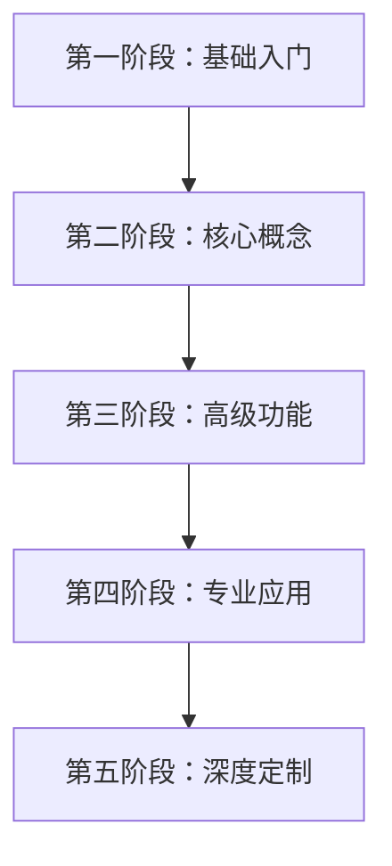

# OpenClaw 学习路线图 🦞

本文档为想要深入学习 OpenClaw 的开发者提供了一个结构化的学习路径。根据你的经验水平和学习目标，选择合适的学习阶段。

## 路线图概览



---

## 第一阶段：基础入门 (1-2 天)

**目标**：快速上手，理解 OpenClaw 是什么以及如何使用它。

### 1.1 环境准备 (30 分钟)

<Steps>
  <Step title="安装前置条件">
    - 安装 Node.js 22+
    - 了解基本的命令行操作
    - 准备一个 AI API 密钥（推荐 Anthropic）

    📖 参考：[安装概览](/zh-CN/install/index)
  </Step>
  <Step title="安装 OpenClaw">
    使用官方安装脚本快速安装：

    ```bash
    curl -fsSL https://openclaw.ai/install.sh | bash
    ```

    📖 参考：[快速开始](/zh-CN/start/getting-started)
  </Step>
</Steps>

### 1.2 首次配置和运行 (1 小时)

<Steps>
  <Step title="运行向导">
    ```bash
    openclaw onboard --install-daemon
    ```

    了解配置向导的每个步骤的含义

    📖 参考：[配置向导](/zh-CN/start/wizard)
  </Step>
  <Step title="启动网关">
    ```bash
    openclaw gateway status
    openclaw dashboard
    ```

    理解网关（Gateway）的作用

    📖 参考：[网关](/zh-CN/gateway/index)
  </Step>
  <Step title="发送第一条消息">
    通过控制台 UI 或命令行发送消息：

    ```bash
    openclaw message send --target +15555550123 --message "你好，OpenClaw"
    ```

    📖 参考：[消息](/zh-CN/concepts/messages)
  </Step>
</Steps>

### 1.3 连接第一个消息渠道 (1-2 小时)

选择一个最熟悉的平台开始：

<Tabs>
  <Tab title="WhatsApp (推荐)">
    - WhatsApp 是最常用的渠道
    - 使用 Baileys 库实现 Web 协议
    - 需要扫描 QR 码配对

    📖 参考：[WhatsApp](/zh-CN/channels/whatsapp)
  </Tab>
  <Tab title="Telegram">
    - 需要创建 Bot Token
    - 配置简单，适合开发测试

    📖 参考：[Telegram](/zh-CN/channels/telegram)
  </Tab>
  <Tab title="Discord">
    - 需要创建 Discord 应用
    - 适合社区和服务器场景

    📖 参考：[Discord](/zh-CN/channels/discord)
  </Tab>
</Tabs>

### 1.4 理解基本概念 (2-3 小时)

**必读文档**：

1. [什么是 OpenClaw](/zh-CN/index) - 了解项目定位
2. [架构概览](/zh-CN/concepts/architecture) - 理解系统架构
3. [功能特性](/zh-CN/concepts/features) - 知道能做什么
4. [代理（Agent）](/zh-CN/concepts/agent) - 核心概念
5. [会话（Session）](/zh-CN/concepts/session) - 消息和上下文管理

**实践任务**：

- [ ] 成功安装并启动 OpenClaw
- [ ] 连接至少一个消息渠道
- [ ] 通过该渠道与 AI 助手对话
- [ ] 查看会话历史和日志
- [ ] 理解网关、代理、渠道之间的关系

---

## 第二阶段：核心概念 (3-5 天)

**目标**：深入理解 OpenClaw 的核心机制和配置选项。

### 2.1 网关深入学习 (1 天)

<AccordionGroup>
  <Accordion title="网关配置">
    - 配置文件位置：`~/.openclaw/openclaw.json`
    - 理解配置结构和关键选项
    - 环境变量 vs 配置文件

    📖 参考：[网关配置](/zh-CN/gateway/configuration)、[配置示例](/zh-CN/gateway/configuration-examples)
  </Accordion>
  <Accordion title="网关运行模式">
    - 前台运行 vs 后台服务
    - systemd / launchd 集成
    - 健康检查和心跳

    📖 参考：[后台进程](/zh-CN/gateway/background-process)、[健康检查](/zh-CN/gateway/health)、[心跳](/zh-CN/gateway/heartbeat)
  </Accordion>
  <Accordion title="网关安全">
    - 认证和授权
    - Token 管理
    - 白名单和访问控制

    📖 参考：[安全](/zh-CN/gateway/security/index)、[认证](/zh-CN/gateway/authentication)
  </Accordion>
  <Accordion title="故障排查">
    - 日志查看和分析
    - 常见问题诊断
    - Doctor 工具使用

    📖 参考：[故障排查](/zh-CN/gateway/troubleshooting)、[Doctor](/zh-CN/gateway/doctor)、[日志](/zh-CN/gateway/logging)
  </Accordion>
</AccordionGroup>

**实践任务**：

- [ ] 自定义网关配置
- [ ] 设置网关为系统服务
- [ ] 配置访问控制和安全策略
- [ ] 使用 `openclaw doctor` 诊断系统
- [ ] 查看和分析网关日志

### 2.2 消息渠道详解 (1-2 天)

**学习所有支持的渠道**：

<Columns>
  <Card title="主流平台" icon="message-square">
    - [WhatsApp](/zh-CN/channels/whatsapp)
    - [Telegram](/zh-CN/channels/telegram)
    - [Discord](/zh-CN/channels/discord)
    - [Slack](/zh-CN/channels/slack)
  </Card>
  <Card title="企业平台" icon="building">
    - [飞书](/zh-CN/channels/feishu)
    - [Google Chat](/zh-CN/channels/googlechat)
    - [Mattermost](/zh-CN/channels/mattermost)
    - [Microsoft Teams](/zh-CN/channels/msteams)
  </Card>
  <Card title="其他平台" icon="grid">
    - [Signal](/zh-CN/channels/signal)
    - [iMessage](/zh-CN/channels/imessage)
    - [LINE](/zh-CN/channels/line)
    - [Matrix](/zh-CN/channels/matrix)
    - [Zalo](/zh-CN/channels/zalo)
  </Card>
</Columns>

**深入理解**：

- 渠道路由和优先级
- 群组消息处理
- 提及（mention）模式
- 广播群组

📖 参考：[渠道路由](/zh-CN/concepts/channel-routing)、[群组](/zh-CN/concepts/groups)、[群组消息](/zh-CN/concepts/group-messages)、[广播群组](/zh-CN/broadcast-groups)

**实践任务**：

- [ ] 连接至少 3 个不同的消息渠道
- [ ] 配置群组消息规则
- [ ] 设置渠道路由策略
- [ ] 测试广播消息功能

### 2.3 代理系统深入 (1-2 天)

<Steps>
  <Step title="代理运行循环">
    理解代理如何处理消息：
    - 消息接收
    - 上下文构建
    - 工具调用
    - 响应生成

    📖 参考：[代理循环](/zh-CN/concepts/agent-loop)
  </Step>
  <Step title="系统提示词">
    - 提示词模板系统
    - 自定义代理行为
    - AGENTS、SOUL、TOOLS 等模板

    📖 参考：[系统提示词](/zh-CN/concepts/system-prompt)、[模板](/zh-CN/reference/templates/AGENTS)
  </Step>
  <Step title="会话和记忆">
    - 会话隔离策略
    - 上下文管理
    - 会话压缩
    - 记忆系统

    📖 参考：[会话](/zh-CN/concepts/sessions)、[记忆](/zh-CN/concepts/memory)、[压缩](/zh-CN/concepts/compaction)
  </Step>
  <Step title="多代理协作">
    - 多代理路由
    - 工作区隔离
    - 代理间通信
    - 存在感（Presence）

    📖 参考：[多代理](/zh-CN/concepts/multi-agent)、[存在感](/zh-CN/concepts/presence)、[代理工作区](/zh-CN/concepts/agent-workspace)
  </Step>
</Steps>

**实践任务**：

- [ ] 自定义代理提示词模板
- [ ] 配置多个代理实例
- [ ] 测试会话隔离
- [ ] 实现多代理协作场景

### 2.4 模型提供商 (1 天)

**支持的 AI 提供商**：

<Tabs>
  <Tab title="主流提供商">
    - [Anthropic](/zh-CN/providers/anthropic) (推荐)
    - [OpenAI](/zh-CN/providers/openai)
    - [OpenRouter](/zh-CN/providers/openrouter)
    - [AWS Bedrock](/zh-CN/bedrock)
  </Tab>
  <Tab title="中国提供商">
    - [智谱 GLM](/zh-CN/providers/glm)
    - [Moonshot（月之暗面）](/zh-CN/providers/moonshot)
    - [MiniMax](/zh-CN/providers/minimax)
    - [百度千帆](/zh-CN/providers/qianfan)
    - [ZAI](/zh-CN/providers/zai)
  </Tab>
  <Tab title="其他">
    - [OpenCode](/zh-CN/providers/opencode)
    - [Vercel AI Gateway](/zh-CN/providers/vercel-ai-gateway)
    - [Synthetic](/zh-CN/providers/synthetic)
  </Tab>
</Tabs>

**高级配置**：

- 模型提供商配置
- 模型故障转移
- 本地模型集成

📖 参考：[模型](/zh-CN/concepts/models)、[模型提供商](/zh-CN/concepts/model-providers)、[模型故障转移](/zh-CN/concepts/model-failover)

**实践任务**：

- [ ] 配置至少 2 个不同的模型提供商
- [ ] 设置模型故障转移
- [ ] 测试不同模型的性能和响应
- [ ] 理解 token 使用和成本

---

## 第三阶段：高级功能 (5-7 天)

**目标**：掌握 OpenClaw 的高级特性和工具系统。

### 3.1 工具系统 (2 天)

**内置工具学习**：

<CardGroup cols={2}>
  <Card title="Lobster" icon="claw-marks">
    文件系统操作工具

    📖 参考：[Lobster](/zh-CN/tools/lobster)
  </Card>
  <Card title="LLM Task" icon="brain">
    委托 LLM 任务

    📖 参考：[LLM Task](/zh-CN/tools/llm-task)
  </Card>
  <Card title="Exec" icon="terminal">
    命令执行工具

    📖 参考：[Exec](/zh-CN/tools/exec)
  </Card>
  <Card title="Web" icon="globe">
    网页抓取和交互

    📖 参考：[Web](/zh-CN/tools/web)
  </Card>
  <Card title="Browser" icon="browser">
    浏览器自动化

    📖 参考：[Browser](/zh-CN/tools/browser)
  </Card>
  <Card title="Elevated" icon="shield">
    提权操作

    📖 参考：[Elevated](/zh-CN/tools/elevated)
  </Card>
</CardGroup>

**工具扩展**：

- Slash Commands（斜杠命令）
- Skills（技能系统）
- ClawHub（技能市场）

📖 参考：[斜杠命令](/zh-CN/tools/slash-commands)、[Skills](/zh-CN/tools/skills)、[ClawHub](/zh-CN/tools/clawhub)

**实践任务**：

- [ ] 创建自定义 slash command
- [ ] 编写并安装一个 skill
- [ ] 配置浏览器自动化任务
- [ ] 测试工具权限和安全策略

### 3.2 自动化系统 (1-2 天)

<Steps>
  <Step title="Hooks（钩子）">
    - 生命周期钩子
    - 事件触发器
    - 自定义钩子脚本

    📖 参考：[Hooks](/zh-CN/hooks)
  </Step>
  <Step title="定时任务">
    - Cron 作业配置
    - 心跳 vs Cron
    - 任务调度策略

    📖 参考：[Cron 作业](/zh-CN/automation/cron-jobs)、[Cron vs Heartbeat](/zh-CN/automation/cron-vs-heartbeat)
  </Step>
  <Step title="Webhook 集成">
    - 接收外部 Webhook
    - 触发自动化流程

    📖 参考：[Webhook](/zh-CN/automation/webhook)
  </Step>
  <Step title="其他自动化">
    - Gmail Pub/Sub 集成
    - 轮询（Poll）机制
    - 认证监控

    📖 参考：[Gmail Pub/Sub](/zh-CN/automation/gmail-pubsub)、[Poll](/zh-CN/automation/poll)、[认证监控](/zh-CN/automation/auth-monitoring)
  </Step>
</Steps>

**实践任务**：

- [ ] 配置每日任务提醒
- [ ] 创建 Webhook 端点
- [ ] 设置自动化监控
- [ ] 实现自定义生命周期钩子

### 3.3 媒体和设备支持 (1-2 天)

**Nodes（节点）系统**：

OpenClaw 支持将移动设备作为"节点"连接，提供媒体能力：

<Columns>
  <Card title="iOS 节点" icon="apple">
    iOS 设备作为相机、麦克风、位置源

    📖 参考：[iOS](/zh-CN/platforms/ios)
  </Card>
  <Card title="Android 节点" icon="android">
    Android 设备集成

    📖 参考：[Android](/zh-CN/platforms/android)
  </Card>
  <Card title="macOS 节点" icon="desktop">
    macOS 配套应用

    📖 参考：[macOS](/zh-CN/platforms/macos)
  </Card>
</Columns>

**媒体功能**：

- [图片处理](/zh-CN/nodes/images)
- [音频处理](/zh-CN/nodes/audio)
- [相机控制](/zh-CN/nodes/camera)
- [语音唤醒](/zh-CN/nodes/voicewake)
- [对话模式](/zh-CN/nodes/talk)
- [位置命令](/zh-CN/nodes/location-command)

📖 参考：[节点概览](/zh-CN/nodes/index)

**实践任务**：

- [ ] 配对一个移动设备作为节点
- [ ] 测试相机拍照功能
- [ ] 实现语音交互
- [ ] 获取和使用位置信息

### 3.4 Web 界面和 TUI (1 天)

<Tabs>
  <Tab title="Control UI">
    浏览器控制面板：
    - 聊天界面
    - 配置管理
    - 会话查看
    - 节点管理

    📖 参考：[Control UI](/zh-CN/web/control-ui)
  </Tab>
  <Tab title="Dashboard">
    仪表板功能

    📖 参考：[Dashboard](/zh-CN/web/dashboard)
  </Tab>
  <Tab title="WebChat">
    独立聊天界面

    📖 参考：[WebChat](/zh-CN/web/webchat)
  </Tab>
  <Tab title="TUI">
    终端用户界面

    📖 参考：[TUI](/zh-CN/tui)
  </Tab>
</Tabs>

**实践任务**：

- [ ] 熟悉 Control UI 的所有功能
- [ ] 使用 TUI 进行命令行交互
- [ ] 配置远程访问 Web 界面

---

## 第四阶段：专业应用 (7-10 天)

**目标**：在生产环境中部署和运维 OpenClaw。

### 4.1 部署和托管 (2-3 天)

**部署选项**：

<Tabs>
  <Tab title="本地部署">
    在自己的服务器或 VPS 上运行：
    - Linux 服务器配置
    - 系统服务集成
    - 反向代理设置

    📖 参考：[Linux](/zh-CN/platforms/linux)、[后台进程](/zh-CN/gateway/background-process)
  </Tab>
  <Tab title="云平台">
    云服务托管：
    - [Fly.io](/zh-CN/install/fly)
    - [Hetzner](/zh-CN/install/hetzner)
    - [Google Cloud](/zh-CN/install/gcp)
    - [Railway](/zh-CN/install/railway)
    - [Render](/zh-CN/install/render)
    - [Northflank](/zh-CN/install/northflank)
  </Tab>
  <Tab title="容器化">
    Docker 部署：
    - Docker 镜像构建
    - Docker Compose 配置
    - 容器编排

    📖 参考：[Docker](/zh-CN/install/docker)
  </Tab>
  <Tab title="其他">
    - [Nix](/zh-CN/install/nix)
    - [Ansible](/zh-CN/install/ansible)
    - [macOS VM](/zh-CN/install/macos-vm)
  </Tab>
</Tabs>

**实践任务**：

- [ ] 在 VPS 上部署 OpenClaw
- [ ] 配置 systemd 服务
- [ ] 设置 Docker 容器部署
- [ ] 配置自动重启和监控

### 4.2 远程访问和安全 (1-2 天)

<Steps>
  <Step title="远程访问配置">
    - SSH 隧道
    - Tailscale 集成
    - 反向代理（Nginx/Caddy）

    📖 参考：[远程访问](/zh-CN/gateway/remote)、[Tailscale](/zh-CN/gateway/tailscale)
  </Step>
  <Step title="安全加固">
    - 认证和授权
    - Token 管理
    - IP 白名单
    - 加密传输

    📖 参考：[安全](/zh-CN/gateway/security/index)、[认证](/zh-CN/gateway/authentication)
  </Step>
  <Step title="沙箱和隔离">
    - 工具沙箱
    - 权限管理
    - 资源限制

    📖 参考：[沙箱](/zh-CN/gateway/sandboxing)、[工具策略](/zh-CN/gateway/sandbox-vs-tool-policy-vs-elevated)
  </Step>
</Steps>

**实践任务**：

- [ ] 配置 Tailscale 访问
- [ ] 设置 HTTPS 和证书
- [ ] 实现多层认证
- [ ] 配置工具沙箱策略

### 4.3 监控和运维 (2 天)

<AccordionGroup>
  <Accordion title="日志管理">
    - 日志级别配置
    - 日志轮换
    - 日志分析和搜索

    📖 参考：[日志](/zh-CN/gateway/logging)
  </Accordion>
  <Accordion title="健康监控">
    - 健康检查端点
    - 心跳机制
    - 告警配置

    📖 参考：[健康检查](/zh-CN/gateway/health)、[心跳](/zh-CN/gateway/heartbeat)
  </Accordion>
  <Accordion title="故障诊断">
    - Doctor 工具
    - 常见问题处理
    - 性能调优

    📖 参考：[Doctor](/zh-CN/gateway/doctor)、[故障排查](/zh-CN/gateway/troubleshooting)
  </Accordion>
  <Accordion title="更新和维护">
    - 版本更新
    - 配置迁移
    - 数据备份

    📖 参考：[更新](/zh-CN/install/updating)、[迁移](/zh-CN/install/migrating)
  </Accordion>
</AccordionGroup>

**实践任务**：

- [ ] 设置日志收集系统
- [ ] 配置监控告警
- [ ] 进行性能基准测试
- [ ] 执行版本升级流程

### 4.4 协议和 API (2-3 天)

<Steps>
  <Step title="Gateway 协议">
    WebSocket 协议详解：
    - 连接握手
    - 请求/响应模式
    - 事件订阅
    - 设备配对

    📖 参考：[Gateway 协议](/zh-CN/gateway/protocol)、[配对](/zh-CN/gateway/pairing)
  </Step>
  <Step title="HTTP API">
    - OpenAI 兼容 API
    - 工具调用 API
    - CLI 后端

    📖 参考：[OpenAI HTTP API](/zh-CN/gateway/openai-http-api)、[工具调用 HTTP API](/zh-CN/gateway/tools-invoke-http-api)、[CLI 后端](/zh-CN/gateway/cli-backends)
  </Step>
  <Step title="RPC 集成">
    - RPC 模式
    - 设备模型
    - 自定义客户端

    📖 参考：[RPC](/zh-CN/reference/rpc)、[设备模型](/zh-CN/reference/device-models)
  </Step>
  <Step title="Bridge 协议">
    跨网关通信

    📖 参考：[Bridge 协议](/zh-CN/gateway/bridge-protocol)
  </Step>
</Steps>

**实践任务**：

- [ ] 编写自定义 WebSocket 客户端
- [ ] 集成 OpenAI 兼容 API
- [ ] 实现设备配对流程
- [ ] 创建跨网关通信应用

---

## 第五阶段：深度定制 (10+ 天)

**目标**：成为 OpenClaw 专家，能够深度定制和扩展系统。

### 5.1 插件开发 (3-5 天)

<Steps>
  <Step title="插件 SDK">
    - 插件系统架构
    - SDK API 文档
    - 插件生命周期

    📖 参考：[插件](/zh-CN/plugin)
  </Step>
  <Step title="渠道插件">
    开发自定义消息渠道：
    - Teams 插件示例
    - Matrix 插件示例
    - Zalo 插件示例

    📖 参考：[Teams](/zh-CN/channels/msteams)、[Matrix](/zh-CN/channels/matrix)、[Zalo](/zh-CN/channels/zalo)
  </Step>
  <Step title="工具插件">
    创建自定义工具和技能

    📖 参考：[Skills 配置](/zh-CN/tools/skills-config)
  </Step>
  <Step title="发布插件">
    - 插件打包
    - ClawHub 发布
    - 版本管理

    📖 参考：[ClawHub](/zh-CN/tools/clawhub)
  </Step>
</Steps>

**实践任务**：

- [ ] 开发一个自定义消息渠道插件
- [ ] 创建一个工具插件
- [ ] 将插件发布到 ClawHub
- [ ] 为插件编写文档

### 5.2 源码贡献 (5-7 天)

<Steps>
  <Step title="开发环境搭建">
    - 克隆仓库
    - 安装依赖
    - 运行测试
    - 本地构建

    📖 参考：[开发者设置](/zh-CN/start/setup)、[测试](/zh-CN/testing)
  </Step>
  <Step title="代码库理解">
    - 项目结构
    - 核心模块
    - 设计模式
    - 测试策略

    📖 参考：[环境](/zh-CN/environment)、[调试](/zh-CN/debugging)
  </Step>
  <Step title="贡献流程">
    - 提交问题
    - 创建 PR
    - 代码审查
    - 发布流程

    📖 参考：发布文档（内部）
  </Step>
  <Step title="平台特定开发">
    - macOS 应用开发
    - iOS 应用开发
    - Android 应用开发

    📖 参考：[macOS 开发](/zh-CN/platforms/mac/dev-setup)
  </Step>
</Steps>

**实践任务**：

- [ ] 从源码构建 OpenClaw
- [ ] 修复一个小 bug 或添加小功能
- [ ] 提交你的第一个 PR
- [ ] 参与代码审查

### 5.3 高级架构主题 (2-3 天)

<AccordionGroup>
  <Accordion title="网络模型">
    深入理解网络架构：
    - 发现机制
    - Bonjour 集成
    - 多网关协调

    📖 参考：[网络模型](/zh-CN/gateway/network-model)、[发现](/zh-CN/gateway/discovery)、[Bonjour](/zh-CN/gateway/bonjour)、[多网关](/zh-CN/gateway/multiple-gateways)
  </Accordion>
  <Accordion title="消息队列">
    消息传递机制：
    - 队列管理
    - 重试策略
    - 流式传输

    📖 参考：[队列](/zh-CN/concepts/queue)、[重试](/zh-CN/concepts/retry)、[流式传输](/zh-CN/concepts/streaming)
  </Accordion>
  <Accordion title="会话管理">
    高级会话策略：
    - 会话修剪
    - 压缩算法
    - 记忆系统

    📖 参考：[会话修剪](/zh-CN/concepts/session-pruning)、[压缩](/zh-CN/concepts/compaction)、[记忆](/zh-CN/concepts/memory)
  </Accordion>
  <Accordion title="类型系统">
    TypeBox 和类型安全：
    - Schema 定义
    - 类型生成
    - 验证机制

    📖 参考：[TypeBox](/zh-CN/concepts/typebox)
  </Accordion>
</AccordionGroup>

**实践任务**：

- [ ] 实现自定义会话压缩策略
- [ ] 创建多网关集群
- [ ] 优化消息队列性能
- [ ] 扩展类型系统

### 5.4 macOS 应用高级开发 (可选，2-3 天)

如果你对 macOS 平台感兴趣：

<Columns>
  <Card title="核心功能" icon="apple">
    - [菜单栏](/zh-CN/platforms/mac/menu-bar)
    - [语音唤醒](/zh-CN/platforms/mac/voicewake)
    - [语音覆盖层](/zh-CN/platforms/mac/voice-overlay)
    - [Canvas](/zh-CN/platforms/mac/canvas)
  </Card>
  <Card title="系统集成" icon="gear">
    - [子进程](/zh-CN/platforms/mac/child-process)
    - [权限](/zh-CN/platforms/mac/permissions)
    - [XPC](/zh-CN/platforms/mac/xpc)
    - [Skills](/zh-CN/platforms/mac/skills)
  </Card>
  <Card title="运维" icon="wrench">
    - [健康监控](/zh-CN/platforms/mac/health)
    - [日志](/zh-CN/platforms/mac/logging)
    - [签名](/zh-CN/platforms/mac/signing)
    - [发布](/zh-CN/platforms/mac/release)
  </Card>
</Columns>

📖 参考：[macOS 开发设置](/zh-CN/platforms/mac/dev-setup)

---

## 学习资源和工具

### 官方文档

- **文档中心**：https://docs.openclaw.ai
- **文档索引**：[文档目录](/zh-CN/start/docs-directory)
- **所有文档链接**：[文档 Hub](/zh-CN/start/hubs)

### 社区和支持

- **GitHub 仓库**：https://github.com/openclaw/openclaw
- **问题追踪**：GitHub Issues
- **讨论区**：GitHub Discussions
- **社区故事**：[Lore](/zh-CN/start/lore)

### CLI 参考

完整的命令行工具文档：

- [CLI 概览](/zh-CN/cli/index)
- [Agent 命令](/zh-CN/cli/agent)
- [Gateway 命令](/zh-CN/cli/gateway)
- [Message 命令](/zh-CN/cli/message)
- [Channels 命令](/zh-CN/cli/channels)
- [更多命令...](/zh-CN/cli/index)

### 帮助和故障排查

<Columns>
  <Card title="FAQ" href="/zh-CN/help/faq" icon="question">
    常见问题解答
  </Card>
  <Card title="故障排查" href="/zh-CN/help/troubleshooting" icon="wrench">
    问题诊断和解决
  </Card>
  <Card title="渠道故障排查" href="/zh-CN/channels/troubleshooting" icon="message-square">
    消息渠道特定问题
  </Card>
  <Card title="节点故障排查" href="/zh-CN/nodes/troubleshooting" icon="smartphone">
    设备节点问题
  </Card>
</Columns>

---

## 学习检查清单

使用此清单追踪你的学习进度：

### 基础阶段 ✓

- [ ] 安装 OpenClaw 并成功运行
- [ ] 连接第一个消息渠道
- [ ] 理解网关、代理、会话的概念
- [ ] 能够通过消息渠道与 AI 对话
- [ ] 查看和管理配置文件

### 进阶阶段 ✓

- [ ] 连接多个消息渠道
- [ ] 配置自定义代理提示词
- [ ] 设置多代理路由
- [ ] 配置至少 2 个模型提供商
- [ ] 实现模型故障转移
- [ ] 理解网关协议和 WebSocket 通信

### 高级阶段 ✓

- [ ] 创建自定义 slash command 和 skill
- [ ] 配置定时任务和 Webhook
- [ ] 连接移动设备节点
- [ ] 实现语音和媒体交互
- [ ] 在生产环境部署 OpenClaw
- [ ] 配置远程访问和安全策略

### 专家阶段 ✓

- [ ] 开发自定义插件
- [ ] 从源码构建并贡献代码
- [ ] 实现自定义协议客户端
- [ ] 优化性能和资源使用
- [ ] 配置多网关集群
- [ ] 深度定制系统行为

---

## 推荐学习路径

### 路径 1：快速实用派 (1-2 周)

适合想快速上手使用的用户：

1. **第一阶段：基础入门** (完整学习)
2. **第二阶段：核心概念** (重点：2.1 网关、2.2 渠道)
3. **第三阶段：高级功能** (重点：3.2 自动化)
4. **第四阶段：专业应用** (重点：4.1 部署)

跳过：插件开发、源码贡献

### 路径 2：全栈开发者 (3-4 周)

适合想深入理解和扩展系统的开发者：

1. **第一阶段：基础入门** (完整)
2. **第二阶段：核心概念** (完整)
3. **第三阶段：高级功能** (完整)
4. **第四阶段：专业应用** (完整)
5. **第五阶段：深度定制** (重点：5.1 插件开发、5.2 源码贡献)

### 路径 3：企业运维工程师 (2-3 周)

适合负责部署和运维的工程师：

1. **第一阶段：基础入门** (快速浏览)
2. **第二阶段：核心概念** (重点：2.1 网关)
3. **第三阶段：高级功能** (重点：3.2 自动化)
4. **第四阶段：专业应用** (完整，深入学习)
5. **第五阶段：深度定制** (重点：5.3 高级架构)

### 路径 4：AI 应用开发者 (2-3 周)

适合专注于 AI 应用和交互的开发者：

1. **第一阶段：基础入门** (完整)
2. **第二阶段：核心概念** (重点：2.3 代理系统、2.4 模型)
3. **第三阶段：高级功能** (重点：3.1 工具系统、3.3 媒体)
4. **第四阶段：专业应用** (部分：4.4 API)
5. **第五阶段：深度定制** (重点：5.1 插件开发)

---

## 实践项目建议

为了巩固学习，尝试完成这些实践项目：

### 初级项目

1. **个人 AI 助手**
   - 连接 WhatsApp/Telegram
   - 配置日程提醒
   - 实现简单的问答

2. **多渠道消息中转**
   - 连接 2-3 个消息平台
   - 实现跨平台消息转发
   - 设置群组管理规则

### 中级项目

3. **智能家居控制**
   - 集成智能家居 API
   - 通过消息控制设备
   - 设置自动化场景

4. **团队协作助手**
   - 连接企业消息平台
   - 实现会议安排、文档查询
   - 配置多代理协作

5. **内容监控机器人**
   - 定时爬取网站
   - Webhook 接收通知
   - 智能摘要和推送

### 高级项目

6. **自定义渠道插件**
   - 为新平台开发插件
   - 实现完整的消息收发
   - 支持媒体和富文本

7. **分布式 AI 网关**
   - 多地域部署网关
   - 负载均衡和故障转移
   - 跨网关协调

8. **企业级 AI 平台**
   - 完整的认证授权
   - 多租户隔离
   - 审计和合规
   - 性能监控和告警

---

## 持续学习建议

1. **跟踪更新**
   - 关注 GitHub releases
   - 阅读 changelog
   - 参与社区讨论

2. **实践为主**
   - 每学习一个概念，立即实践
   - 解决实际问题
   - 分享经验和案例

3. **深入源码**
   - 阅读核心模块代码
   - 理解设计决策
   - 贡献 bug 修复和功能

4. **参与社区**
   - 回答其他用户问题
   - 分享插件和技能
   - 提交改进建议

---

## 获取帮助

遇到问题时：

1. **查阅文档**：先在[文档中心](https://docs.openclaw.ai)搜索
2. **FAQ**：查看[常见问题](/zh-CN/help/faq)
3. **故障排查**：使用[故障排查指南](/zh-CN/help/troubleshooting)
4. **Doctor 工具**：运行 `openclaw doctor` 诊断
5. **GitHub Issues**：搜索或提交 issue
6. **社区讨论**：在 GitHub Discussions 提问

---

## 总结

OpenClaw 是一个功能强大且灵活的多渠道 AI 网关系统。通过这个学习路线图，你可以：

- **1-2 天**：快速上手，开始使用
- **1-2 周**：掌握核心功能，日常使用
- **3-4 周**：精通高级特性，生产部署
- **2-3 月**：成为专家，深度定制和贡献

记住，学习是一个循序渐进的过程。不要试图一次掌握所有内容，而是根据自己的需求和兴趣选择合适的学习路径。

祝你学习愉快！🦞

---

## 相关链接

<Columns>
  <Card title="快速开始" href="/zh-CN/start/getting-started" icon="rocket">
    立即开始安装和使用
  </Card>
  <Card title="文档 Hub" href="/zh-CN/start/hubs" icon="book">
    所有文档的完整索引
  </Card>
  <Card title="架构概览" href="/zh-CN/concepts/architecture" icon="sitemap">
    理解系统架构
  </Card>
  <Card title="帮助中心" href="/zh-CN/help/index" icon="life-buoy">
    获取帮助和支持
  </Card>
</Columns>
